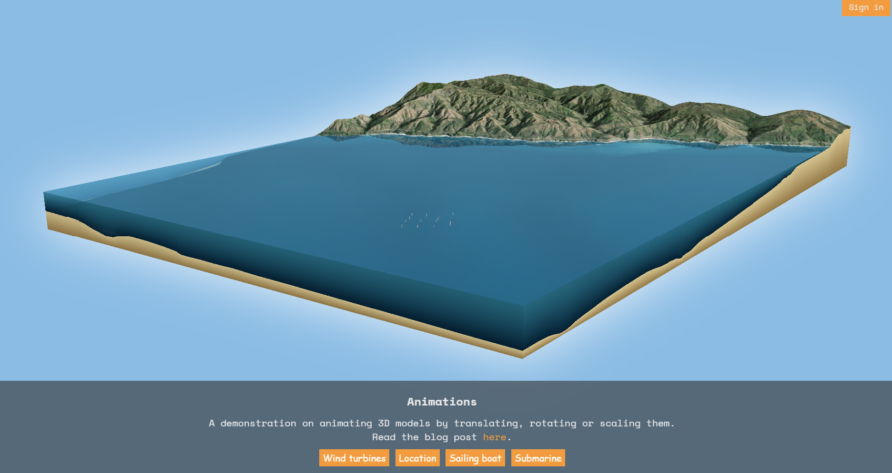

# 3D diorama

A web application that demonstrates animations of graphics with mesh geometry in ArcGIS Maps SDK for JavaScript.

[](https://geoxc-apps4.bd.esri.com/experiments/animations/)

## Instructions:

You need to have [git](https://git-scm.com/) and [npm](https://www.npmjs.com/) installed on your machine.
Clone this repository to your computer with the following command:

```sh
git clone git@github.com:RalucaNicola/3D-diorama.git
```

Install the modules that are need to run the app:

```sh
npm install
```

## Running the app for development

Now you can start the vite development server to test the app on your local machine:

```sh
# it will start a server instance and begin listening for connections from localhost on port 3000
npm run dev
```

## Deployment

To build/deploy the app, you can simply run:

```sh
# it will place all files needed for deployment into the /dist directory
npm run build
```

Copy the content of the `/dist` directory to the server where you want to deploy the application.

## Requirements

- [ArcGIS Maps SDK for JavaScript](https://developers.arcgis.com/javascript/index.html)

## Issues

Find a bug or want to request a new feature? Please let us know by submitting an issue.

## Contributing

Esri welcomes contributions from anyone and everyone. Please see our [guidelines for contributing](https://github.com/esri/contributing).

## Licensing

Copyright 2022 Esri

Licensed under the Apache License, Version 2.0 (the "License");
you may not use this file except in compliance with the License.
You may obtain a copy of the License at

http://www.apache.org/licenses/LICENSE-2.0

Unless required by applicable law or agreed to in writing, software
distributed under the License is distributed on an "AS IS" BASIS,
WITHOUT WARRANTIES OR CONDITIONS OF ANY KIND, either express or implied.
See the License for the specific language governing permissions and
limitations under the License.

A copy of the license is available in the repository's [license.txt](license.txt) file.
